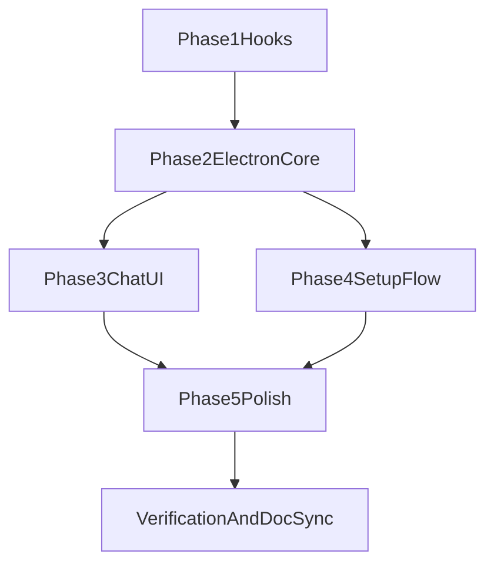

# Meeting Room Parent Plan

## Objective
Implement all requirements in `DESIGN.md` into a working Electron application with Python hooks and continuously updated nested planning documents.

## Delivery Order
1. Phase 1: Hook layer
2. Phase 2: Electron core runtime
3. Phase 3: Chat UI and interaction model
4. Phase 4: Setup and meeting lifecycle
5. Phase 5: Polishing features
6. Verification and documentation sync

## Dependency Graph

## Progress Tracking Rules
- Update `TODO.md` whenever a phase starts/completes.
- Update the corresponding `plans/phase-*.md` during implementation, not only at the end.
- Keep implementation decisions and deviations logged in each phase plan.

## Current Focus
- All planned phases are implemented.
- Next operational step: run `npm run dev` in `electron/` and validate live Claude integration in your environment.
- Web parity work is tracked in `plans/web-interface-parity.md` and `TODO.md` (`W1`-`W5`).
