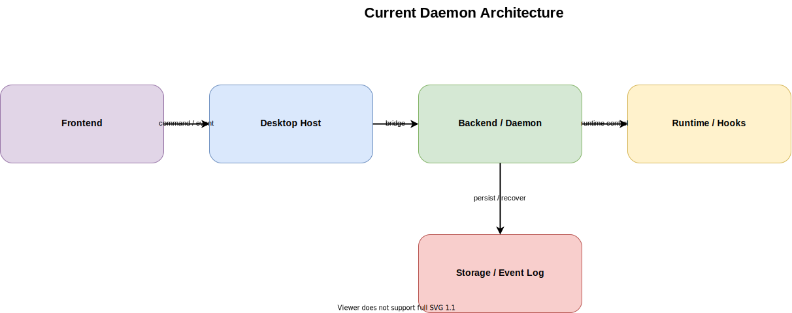

# Current Daemon Architecture

作成日: 2026-03-09

## 概要

- 現在の cc-roundtable は、`meeting-room-daemon` を会議セッションの主系に置き、Electron、Browser UI、固定デモ向け Public Share gateway がその状態を表示・操作する `daemon-first` 構成です。
- Electron main は daemon の起動補助や OS 連携に寄り、会議ライフサイクル、イベント永続化、SSE 配信、runtime orchestration は daemon 側へ集約されています。
- これは将来の Web UI、recovering、長寿命 session host を見据えた現実的な形であり、設計上は `Local Daemon BFF` をすでに採用し始めている状態といえます。

## 一言要約

- いまの主系は「daemon が会議の実体を持ち、Electron と Browser / Public Share はクライアントになる」構成です。
- 今後の論点は新しい境界を足すことより、この daemon-first 構成をどこまで明確に磨き込むかにあります。

## 想定コンポーネント

- Frontend: `src/apps/desktop/src/renderer/MeetingRoomShell.tsx`, `src/apps/desktop/src/renderer/screens/*`, `src/apps/web/src/WebRootApp.tsx`, `src/apps/web/src/PublicShareApp.tsx`
- Backend / Daemon: `src/daemon/src/http/start-meeting-room-daemon-server.ts`, `src/daemon/src/app/meeting-room-daemon-app.ts`, `src/daemon/src/public-share/create-public-share-http-app.ts`
- Runtime: `src/daemon/src/runtime/meeting-runtime-manager.ts`, `src/apps/desktop/src/main/daemon/meeting-room-daemon-manager.ts`
- Storage: `src/daemon/src/sessions/meeting-session-store.ts`, `src/daemon/src/events/`, `.claude/meeting-room/summaries/`
- Hooks / Relay: `.claude/settings.json`, `src/packages/meeting-room-hooks/*.py`, `src/daemon/src/relay/hooks-relay-receiver.ts`

## 主要フロー

1. Setup 画面、Browser UI、または Public Share UI から `startMeeting`、`sendHumanMessage`、`pauseMeeting` などの command が送られる
2. Electron main は daemon command への橋渡しを行い、Browser UI は daemon REST/SSE に直接接続し、Public Share gateway は固定デモ会議だけを絞って relay する
3. daemon が command を処理して session 状態を更新し、必要なら `MeetingRuntimeManager` 経由で Claude runtime を起動する
4. hook relay、terminal event、runtime warning を daemon が受け取り、message / status / diagnostics として正規化する
5. daemon が event log と session view を更新し、SSE で UI に配信する
6. UI は chat / terminal / approval gate / diagnostics を再描画し、再起動時は recovering 状態から復元する

## Browser UI と Public Share の責務差

### Frontend

- Browser UI は full client で、setup、会議開始、terminal、debug、approval、recovering まで担当する
- Public Share UI は restricted client で、固定会議の chat 表示と限定操作だけを担当する
- Browser UI は daemon の full session model を読む
- Public Share UI は public 向けにサニタイズされた session projection だけを読む

### Backend

- daemon は source of truth として session lifecycle、runtime orchestration、hook relay、event persistence を担当する
- Public Share gateway は daemon の前に立つ thin BFF で、固定会議 bootstrap と safe command relay を担当する
- daemon は内部向けの full API を持つ
- Public Share gateway は public 向けの最小 API に絞り、`projectDir` / terminal / debug を出さない

## メリット

- daemon が source of truth を持つため、Electron 再起動後の recovering、Browser UI、Public Share UI の追加が自然に成立する
- 会議ライフサイクル、runtime health、relay 正規化、永続化が 1 か所に集約され、責務が見えやすい
- shared contracts を軸に Electron と Web が同じ会議モデルを使える
- session host を Mac 上の daemon に置く前提がすでにできており、将来の remote UI へ伸ばしやすい

## デメリット

- daemon、Electron main、renderer、browser client の境界がまだ完全には整理し切れておらず、補助責務の重なりが残っている
- hook relay、terminal、生ログ、approval の扱いに歴史的経緯があり、一部に実装のにじみが残っている
- runtime orchestration と session model の責務分離をさらに進めないと、daemon 内部が肥大化する可能性がある

## リスク

- daemon-first へ移った安心感で内部境界の整理を後回しにすると、`MeetingRoomDaemonApp` 周辺に責務が集中しやすい
- recovering、approval、runtime health、event persistence の契約が曖昧なままだと、UI 差分や将来クライアント追加時に不整合が出やすい

## 採用判断の観点

- 向いているフェーズ: すでに進行中の主系アーキテクチャとして、今のプロダクトをそのまま進化させる段階
- 採用できる前提: daemon を session host とみなし、UI は projection 読み取り側に寄せる前提が共有されていること
- 破綻しやすい条件: Electron main や UI 側へ会議状態を戻して二重管理にすること、daemon 内の責務境界を曖昧なまま拡張し続けること
- 実務的な論点: 現在は「採用するかどうか」より、「この構成をどこまで Local Daemon BFF + 明示的 state handling として磨くか」が論点です

## 関連ファイル

- `docs/architecture-definitions/current-daemon/source/current-daemon.drawio`
- `docs/architecture-definitions/current-daemon/current-daemon_subagent-prompt.md`
- `src/daemon/src/app/meeting-room-daemon-app.ts`
- `src/daemon/src/runtime/meeting-runtime-manager.ts`
- `src/daemon/src/sessions/meeting-session-store.ts`
- `src/apps/web/src/browser-meeting-room-client.ts`
- `src/apps/web/src/PublicShareApp.tsx`
- `src/daemon/src/public-share/create-public-share-http-app.ts`
