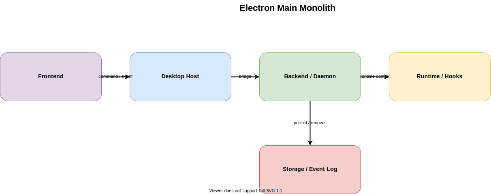

# Electron Main Monolith

作成日: 2026-03-09

## 概要

- `Electron main process` を会議アプリケーションの中心に置き、renderer は薄い UI、Claude 起動、Hook relay 受信、永続化、runtime health 判定を main に集約する案です。
- 現在の Electron ベース実装を最短で整理し直したい時には有効ですが、cc-roundtable がすでに daemon-first を主系にしている現状とは方向が異なります。
- つまり「早くまとめる」には強い一方で、「Mac 上の session host を長寿命化し、Web UI へ広げる」要件には弱い構成です。

## 一言要約

- Electron main を司令塔にして、会議制御から Claude runtime、relay、保存までを同一プロセスで面倒を見る案です。

## 想定コンポーネント

- Frontend: `src/apps/desktop/src/renderer/App.tsx`, `MeetingRoomShell.tsx`, `SetupScreen.tsx`, `MeetingScreen.tsx`
- Backend / Daemon: 専用 daemon を立てず、`src/apps/desktop/src/main/index.ts` と `meeting.ts` が会議ライフサイクルを直接保持する
- Runtime: `pty-manager.ts` が PTY と Claude CLI を直接起動し、ready 検出や prompt 送信も main 側で扱う
- Storage: summary、agent profile、session snapshot を main 配下の file-based storage へ保存する
- Hooks / Relay: `.claude/settings.json` 由来の Hook から main へ直接 relay し、renderer には IPC で通知する

## 主要フロー

1. renderer が IPC 経由で `startMeeting` や `sendHumanMessage` を `main` に送る
2. `main` が meeting state を更新し、必要に応じて `PtyManager` から Claude runtime を起動する
3. Hook relay または terminal 出力を `main` が受けて正規化し、chat message や runtime warning に変換する
4. main が session 状態、summary、debug tail を保存し、renderer へ IPC で配信する
5. renderer は表示に専念し、chat / terminal / diagnostics を更新する

## メリット

- プロセス境界が少ないので、短期的には最も実装速度を出しやすい
- 現在の Electron main 周辺コードや発想を引き継ぎやすく、移行の初速が出る
- ローカル配布や起動モデルが単純で、初期デバッグ時の追跡箇所も少なくて済む
- Electron 専用アプリと割り切るなら、責務の寄せ方として一定の合理性がある

## デメリット

- `main process` が再び肥大化しやすく、会議制御、runtime、relay、保存が密結合になりやすい
- session host が Electron 側に寄るため、Web UI や iPhone からの後付け接続モデルと相性が悪い
- runtime orchestration を UI 実行環境と同じ単位で抱えるので、テストや障害切り分けが難しくなる
- Claude / PTY / Hook 依存を別の境界へ逃がしにくく、将来の差し替えコストが高い

## リスク

- 最初は整理されて見えても、運用を続けると `index.ts` と `meeting.ts` 周辺へ責務が再集中して巨大化しやすい
- 将来 daemon-first に再移行したくなった時、通信契約と state ownership を後から引き直す二度手間が発生しやすい

## 採用判断の観点

- 向いているフェーズ: Electron 専用の短期安定版を急いで出したい初期段階
- 採用できる前提: Web UI や長寿命 daemon を当面考えず、session host を Electron に置いてよいこと
- 破綻しやすい条件: reconnectable session、browser client、runtime isolation、durable event log を本格化したい時
- cc-roundtable での位置づけ: 比較対象としては有用だが、現在の daemon-first 方針に逆行するため主推奨にはしにくい

## 関連ファイル

- `docs/architecture-definitions/electron-main-monolith/source/electron-main-monolith.drawio`
- `docs/architecture-definitions/electron-main-monolith/electron-main-monolith_subagent-prompt.md`
- `src/apps/desktop/src/main/index.ts`
- `src/apps/desktop/src/main/meeting.ts`
- `src/apps/desktop/src/main/pty-manager.ts`
- `src/apps/desktop/src/renderer/MeetingRoomShell.tsx`
