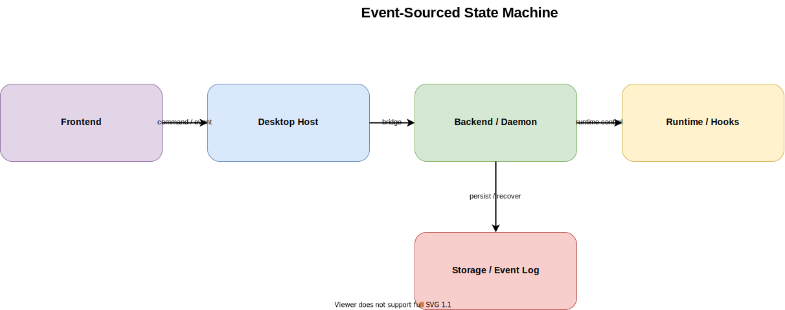

# Event-Sourced State Machine

作成日: 2026-03-09

## 概要

- 会議ライフサイクルを、曖昧なフラグや散発的なコールバックではなく、`command`、`event`、`projection` の3層で扱う案です。
- source of truth は「現在状態」ではなく「何が起きたかの履歴」に寄せます。現在の UI 表示や health 情報は event から再構築します。
- cc-roundtable では PTY 出力、hook relay、人間入力、ready 検知、retry、meeting end が非同期で競合しやすいため、順序を明示できる設計として有効です。
- ただし現状プロダクトに対して全面採用は重く、`init prompt` 配送や `recovering` など、壊れると痛い重要フローに絞った部分導入が現実的です。

## 一言要約

- 「今どうなっているか」ではなく「何が起きたか」を積み上げ、その履歴から会議状態を復元する案です。

## 想定コンポーネント

- Frontend: command 送信と projection 表示に徹する薄い UI。Setup / Meeting / diagnostics は event 由来の read model を表示する
- Backend / Daemon: `CommandHandler`、`MeetingStateMachine`、`ProjectionBuilder`、`MeetingSessionStore` が中心となり、状態遷移と永続化を担う
- Runtime: `MeetingRuntimeManager` が Claude runtime / PTY / ready signal / retry を扱い、低レベル事象を domain event に正規化する
- Storage: append-only event log と projection 用 snapshot。`recovering` 時は event replay または snapshot + 差分 replay で復元する
- Hooks / Relay: hook relay は terminal の補助ではなく event source の1つとして扱い、`AgentMessageReceived` や `AgentStatusChanged` に変換する
- 代表的な command: `StartMeeting`、`QueueInitPrompt`、`DeliverInitPrompt`、`SendHumanMessage`、`PauseMeeting`、`ResumeMeeting`、`EndMeeting`、`RetryMcp`
- 代表的な event: `MeetingStarted`、`InitPromptQueued`、`ClaudeReadyDetected`、`InitPromptSent`、`HumanMessageSubmitted`、`AgentMessageReceived`、`RuntimeWarningRaised`、`MeetingEnded`

## 主要フロー

1. ユーザーまたは system trigger が `startMeeting`、`sendHumanMessage`、`retryMcp` などの command を daemon に送る
2. daemon の `CommandHandler` が現在の state と入力条件を見て妥当性を判定し、必要な event を append する
3. runtime 由来の ready signal、hook relay、warning も domain event に変換されて同じ event log に積まれる
4. `ProjectionBuilder` が event log から `MeetingSessionView`、health、summary を再構築し、必要なら snapshot を更新する
5. SSE / API で UI に projection を返し、Electron / Browser UI はその projection を表示する
6. 再起動後は event log と snapshot を読んで `recovering` 状態を作り、再接続した UI が現状を取り直せるようにする

## メリット

- PTY、hook、human input の競合順序を追跡しやすく、タイミング依存バグに強い
- `recovering`、resume、summary 保存、health 可視化を同じ履歴から再構築できる
- 「なぜその状態になったか」の監査と再現がしやすく、障害調査の一次情報として使いやすい
- source of truth が event log に寄るため、Electron と Browser UI が同じ状態モデルを共有しやすい

## デメリット

- command / event / projection の設計が必要になり、単純な変更でも記述量が増える
- event schema を雑に増やすと、逆に複雑性と保守コストが上がる
- 全面採用すると現状のプロダクト規模に対して過剰設計になりやすい
- チーム全体で「何を event にするか」の判断基準を揃えないと中途半端な設計になる

## リスク

- 低レベル terminal chunk や UI 一時状態まで event 化すると、ログ肥大化とノイズで逆に運用しづらくなる
- projection 再構築コストや schema migration を軽視すると、recovering 時の複雑性が増して導入効果を損なう
- runtime 事象の正規化が甘いと、「event-sourced 風だが結局状態が二重管理」という悪い中間形になる

## 採用判断の観点

- 向いているフェーズ: `daemon-first` の境界は維持したまま、`init prompt` 配送、meeting lifecycle、runtime warning、recovering など重要フローの信頼性を上げたい段階
- 採用してよい前提: source of truth を daemon に寄せる方針が固まっており、event schema と projection の責務分離を受け入れられること
- 部分導入の優先対象: `MeetingStarted`、`InitPromptQueued`、`ClaudeReadyDetected`、`InitPromptSent`、`HumanMessageSubmitted`、`AgentMessageReceived`、`RuntimeWarningRaised`、`MeetingEnded`
- event にしなくてよいもの: 生 terminal chunk 全量、描画専用の一時 state、debug ノイズ、キャッシュ用途の派生データ
- 破綻しやすい条件: 全フローを一気に event-sourcing 化すること、projection 更新責務を曖昧にすること、event schema のバージョニング方針を持たずに進めること
- 実務的な結論: この案単独を全面採用するより、`Local Daemon BFF` の内部規律として重要イベントだけに適用するのが cc-roundtable には最も合います

## 関連ファイル

- `docs/architecture-definitions/event-sourced-state-machine/source/event-sourced-state-machine.drawio`
- `docs/architecture-definitions/event-sourced-state-machine/event-sourced-state-machine_subagent-prompt.md`
- `src/daemon/src/app/meeting-room-daemon-app.ts`
- `src/daemon/src/sessions/meeting-session-store.ts`
- `src/daemon/src/runtime/meeting-runtime-manager.ts`
- `src/packages/shared-contracts/src/meeting-room-daemon.ts`
