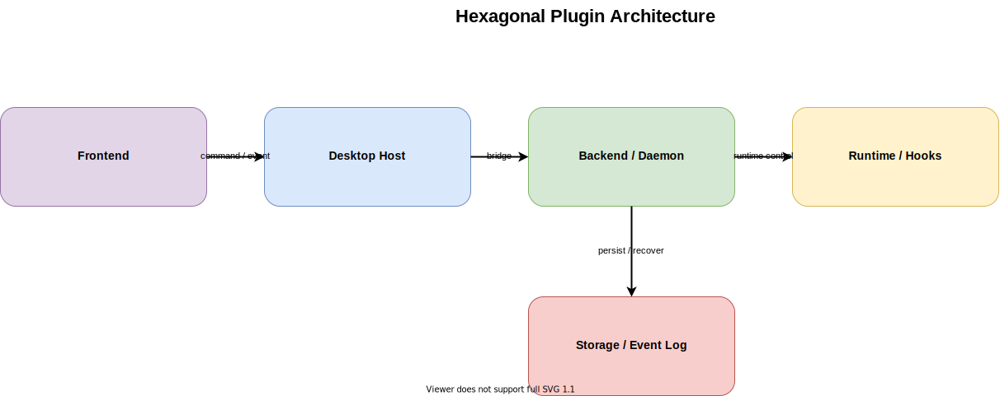

# Hexagonal Plugin Architecture

作成日: 2026-03-09

## 概要

- 会議ドメインを中心に置き、Claude Code、PTY、hook relay、SSE、ファイル永続化、Electron / Web UI をすべて外側の adapter として扱う案です。
- 主系は `meeting-room-daemon` の中に置きつつ、内部の依存方向だけを Hexagonal に揃えることで、daemon-first を維持したままランタイム差し替えやテスト容易性を高めます。
- 重要なのは「daemon を分けること」そのものではなく、「meeting core が Claude や PTY の都合に引きずられないこと」です。

## 一言要約

- `MeetingSession` と `UseCase` をコアに据え、Claude / PTY / hooks / storage / UI は port 越しにだけ接続する構成です。

## 想定コンポーネント

- Frontend:
  - Electron renderer
  - Browser UI
  - どちらも command / event 契約で daemon に接続する薄い client として扱う
- Backend / Daemon:
  - `MeetingUseCase`
  - `MeetingSession`
  - `ApprovalGateService`
  - `SessionProjection`
  - `RuntimeHealthService`
- Runtime:
  - `AgentRuntimePort`
  - `PromptDeliveryPort`
  - `ClaudeCodePtyAdapter`
  - `HookRelayAdapter`
- Storage:
  - `MeetingRepositoryPort`
  - `EventLogPort`
  - `FileSystemMeetingRepository`
  - `FileSummaryStore`
- Hooks / Relay:
  - `RelayIngressPort`
  - `UiSubscriptionPort`
  - `HooksRelayReceiver`
  - `SseEventPublisher`

## 主要フロー

1. Electron renderer または Browser UI が `startMeeting` や `sendHumanMessage` を daemon command に変換する
2. `MeetingUseCase` が command を受け取り、`MeetingSession` の状態遷移と approval gate の更新を行う
3. Claude 連携や prompt 配送が必要な場合だけ、`AgentRuntimePort` / `PromptDeliveryPort` を通じて `ClaudeCodePtyAdapter` を呼ぶ
4. hook relay や runtime warning は `RelayIngressPort` 経由で core に戻り、projection と event log を更新する
5. 更新済みの状態は `UiSubscriptionPort` 経由で SSE / session snapshot として UI に配信され、renderer と browser が同じ source of truth を読む

## メリット

- Claude / PTY / hooks の癖を core に漏らさず、ドメインロジックを守りやすい
- `MeetingUseCase` と `MeetingSession` をモック port でテストしやすく、タイミング依存の不具合を切り分けやすい
- 将来 Claude 以外の runtime や永続化方式に差し替える時も、adapter 側の変更に閉じ込めやすい
- daemon-first を維持したまま内部品質を改善できるので、全面的な再構築より移行しやすい

## デメリット

- port / adapter の切り方を誤ると、抽象化だけが増えて実装速度が落ちる
- 小規模な段階では「直接呼べばよいものまで interface を挟んでいる」ように見えやすい
- 現状コードを段階的に剥がす設計力が必要で、命名や責務分離のレビューコストが上がる

## リスク

- `MeetingUseCase` に残すものと adapter に逃がすものの境界が曖昧だと、Hexagonal ではなく単なる service 分割に終わる
- hook relay や PTY ready 検出のような不安定な I/O を抽象化しても、実装実態を隠しすぎると障害解析が逆に難しくなる

## 採用判断の観点

- 向いているフェーズ:
  - daemon-first は維持したいが、runtime と storage の責務混線を減らしたい段階
  - Web UI や別 runtime 追加を見据えて、内部境界を先に整えたい段階
- 採用しやすい前提:
  - まず core の責務を `meeting lifecycle`、`prompt delivery orchestration`、`projection / recovery` に絞れること
  - port 名と adapter 名を現実の入出力に合わせて素直に置けること
- 破綻しやすい条件:
  - 将来の柔軟性だけを理由に port を量産すること
  - 監視やデバッグ経路を adapter の奥に隠してしまい、実ランタイムの観測性を下げること
  - UI 側の都合で core 契約を頻繁に揺らすこと

## 関連ファイル

- `docs/architecture-definitions/hexagonal-plugin-architecture/source/hexagonal-plugin-architecture.drawio`
- `docs/architecture-definitions/hexagonal-plugin-architecture/hexagonal-plugin-architecture_subagent-prompt.md`
- `src/daemon/src/app/meeting-room-daemon-app.ts`
- `src/daemon/src/runtime/meeting-runtime-manager.ts`
- `src/daemon/src/sessions/meeting-session-store.ts`
