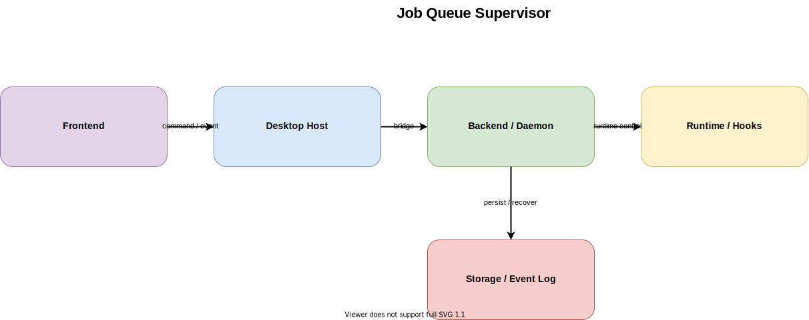

# Job Queue Supervisor

作成日: 2026-03-09

## 概要

- 各会議セッションを独立した job として扱い、supervisor が worker の起動、停止、再試行、失敗確定を担う案です。
- UI は meeting を直接操作せず、command を queue に積み、event stream や projection を通して結果を受け取ります。
- 長時間実行、同時多発 meeting、クラッシュからの自動復旧を重視する場合には筋が良い一方、今の cc-roundtable に対しては最も重い構成です。

## 一言要約

- meeting session を worker job として隔離し、supervisor と queue で運用信頼性を上げる案です。
- ただし、単一ローカル daemon で十分な現段階では、先行投資が大きすぎる可能性があります。

## 想定コンポーネント

- Frontend: Electron renderer / browser UI が command を送信し、queue 経由の進捗や結果を購読する
- Backend / Daemon: Supervisor、CommandQueue、MeetingWorkerFactory、ResultProjection、HealthMonitor
- Runtime: MeetingWorker が Claude runtime、PTY、MCP retry、approval state を 1 meeting 単位で保持する
- Storage: Job metadata、event log、retry state、summary、worker diagnostic log
- Hooks / Relay: 各 worker からの hook relay を supervisor 側で集約し、meeting ごとの event stream に正規化する

## 主要フロー

1. UI が `startMeeting` や `sendHumanMessage` を command として daemon へ送り、daemon は queue に積む
2. Supervisor が command を取り出し、対象 meeting の worker を起動または既存 worker に配送する
3. MeetingWorker が Claude runtime / PTY / hook relay を使って会議を実行する
4. 実行結果、失敗、再試行状態を event log と projection に反映し、必要なら retry policy を適用する
5. UI は event stream を購読し、meeting status、chat、runtime diagnostics を更新する

## メリット

- 会議ごとの隔離性が高く、1 meeting の異常が他 meeting に波及しにくい
- 並列 meeting や長時間実行で worker 単位の再試行、失敗確定、監視を入れやすい
- 将来 remote worker や supervisor の多段化に発展させやすい

## デメリット

- queue、supervisor、worker という新しい運用面の責務が増え、今のローカルプロダクトには重い
- デバッグ時に「UI の問題か、queue の遅延か、worker の失敗か」を切り分けるコストが上がる
- 失敗点が Claude runtime だけでなく queue / scheduler / projection にも広がる

## リスク

- 現時点の cc-roundtable は daemon-first の単一ローカル host で十分成り立っており、過剰設計になる可能性が高い
- approval-gate、hook relay、recovering を worker 分散前提へ寄せると、既存のシンプルなセッション復元モデルを複雑化しやすい

## 採用判断の観点

- どのフェーズで向いているか: 多数の会議を常時並列で回し、クラッシュ耐性や自動再試行が主要価値になる段階
- 何が前提なら採用できるか: worker ごとの state ownership、queue の可観測性、retry policy、運用監視が設計済みであること
- 何が揃っていないと破綻しやすいか: command idempotency、job recovery、projection 再構築、hook relay の routing 設計
- 現状判断: 将来の発展先としては有効だが、いま主系にするよりは `local-daemon-bff` を維持しつつ必要箇所にだけ supervision を導入する方が現実的

## 関連ファイル

- `docs/architecture-definitions/job-queue-supervisor/source/job-queue-supervisor.drawio`
- `docs/architecture-definitions/job-queue-supervisor/job-queue-supervisor_subagent-prompt.md`
