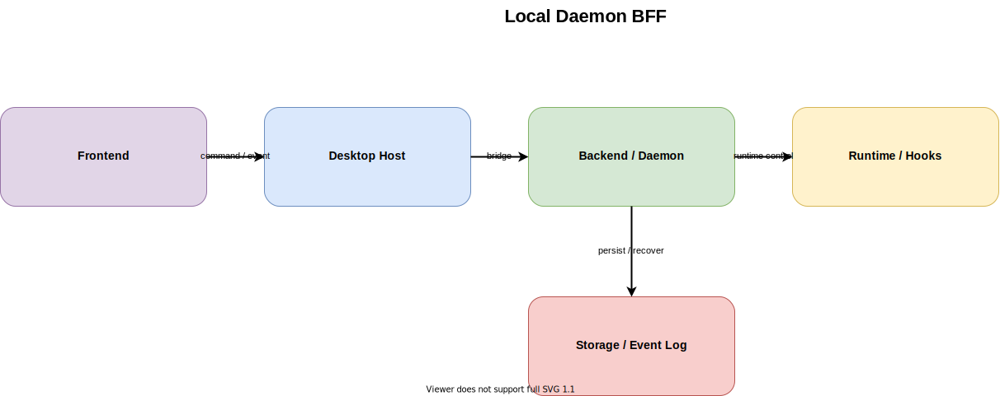

# Local Daemon BFF

作成日: 2026-03-09

## 概要

- 会議セッションの実体をローカル daemon に集約し、Electron renderer と Browser UI はそのクライアントとして振る舞う案です。
- 画面描画、ウィンドウ管理、Claude runtime、永続化、event 配信の責務を分離しやすく、再起動後の recovering や将来の Web 接続にも素直に対応できます。
- cc-roundtable の現状はすでに daemon-first が主系なので、この案は将来案というより「今の構成を整理し直して強化する時の正面案」です。

## 一言要約

- `meeting-room-daemon` を session host にして、Electron と Web を薄いクライアントにする構成です。
- UI を disposable にしつつ、会議状態の source of truth を daemon 側へ寄せます。

## 想定コンポーネント

- Frontend: `src/apps/desktop/src/renderer/MeetingRoomShell.tsx`, `src/apps/web/src/WebRootApp.tsx`, `src/apps/web/src/browser-meeting-room-client.ts`
- Backend / Daemon: `src/daemon/src/http/start-meeting-room-daemon-server.ts`, `src/daemon/src/app/meeting-room-daemon-app.ts`
- Runtime: `src/daemon/src/runtime/meeting-runtime-manager.ts`, `src/apps/desktop/src/main/daemon/meeting-room-daemon-manager.ts`
- Storage: `src/daemon/src/sessions/meeting-session-store.ts`, `src/daemon/src/events/`, `.claude/meeting-room/summaries/`
- Hooks / Relay: `.claude/settings.json`, `src/packages/meeting-room-hooks/*.py`, `src/daemon/src/relay/hooks-relay-receiver.ts`

## 主要フロー

1. Electron renderer または Browser UI が会議開始、手動送信、一時停止などの操作を行う
2. Electron main は daemon command への橋渡しに徹し、Browser UI は daemon REST/SSE を直接使う
3. daemon が command を受けて session を更新し、必要なら Claude runtime を PTY 上で起動する
4. hook relay と runtime event が daemon に集約され、message / status / warning として正規化される
5. daemon が durable event log と session snapshot を更新し、SSE で各 UI に配信する
6. UI は snapshot と event を受け取り、chat / terminal / diagnostics を再描画する

## メリット

- 会議状態の source of truth が daemon に寄るため、Electron 再起動後の recovering と Browser UI 追加が自然になる
- Claude runtime、hook relay、永続化、health monitoring の責務を UI から切り離しやすい
- REST/SSE 契約を共通化できるので、Electron renderer と Browser UI が同じ会議フローを共有しやすい
- `meeting-room-daemon` を単体で検証しやすく、session lifecycle や relay のテストが UI から独立する
- 将来的に Mac 上の常駐 session host を前提としたトンネル接続や remote UI に伸ばしやすい

## デメリット

- Electron main、daemon、Browser UI の境界設計が甘いと、責務の二重化や API の肥大化が起きやすい
- 単一プロセスより起動経路が増えるため、ローカル開発や配布時の起動管理はやや複雑になる
- REST/SSE 契約、session snapshot、recovering 動作を崩すと UI 全体に影響が波及しやすい

## リスク

- UI 側に会議状態を持ちすぎると、daemon と renderer の二重管理になり、recovering 時に不整合が出る
- hook relay、runtime warning、terminal I/O の正規化を daemon へ寄せ切れないと、再び Electron main 側へ複雑さが戻る
- session 永続化の粒度が曖昧だと、resume / reconnect / cleanup の責務境界がぼやける

## 採用判断の観点

- どのフェーズで向いているか: Electron と Browser の両方で同じ会議コアを扱いたい段階、あるいは session 復元と長寿命 runtime を安定化したい段階で最も向いています
- 何が前提なら採用できるか: daemon を session host として扱う前提、command / event 契約を shared contracts に寄せる前提、UI を projection 読み取り側に保つ前提が必要です
- 何が揃っていないと破綻しやすいか: session store の整合、recovering の検証、hook relay の正規化、runtime health の観測が不足していると、この案は単なる多プロセス化で終わってしまいます

## cc-roundtable との整合性

- 現状の主系はすでに daemon-first で、Electron main が直接 PTY を握るよりも local daemon を API/SSE 越しに扱う構成になっています
- `MeetingRoomDaemonApp`、`MeetingSessionStore`、`BrowserMeetingRoomClient`、`MeetingRoomShell` の存在は、この案が机上案ではなく現行アーキテクチャの延長であることを示しています
- 今後の改善ポイントは「daemon-first に移行すること」より、「今ある daemon-first を整理して境界をより明確にすること」です

## 関連ファイル

- `docs/architecture-definitions/local-daemon-bff/source/local-daemon-bff.drawio`
- `docs/architecture-definitions/local-daemon-bff/local-daemon-bff_subagent-prompt.md`
- `src/daemon/src/app/meeting-room-daemon-app.ts`
- `src/daemon/src/sessions/meeting-session-store.ts`
- `src/apps/web/src/browser-meeting-room-client.ts`
