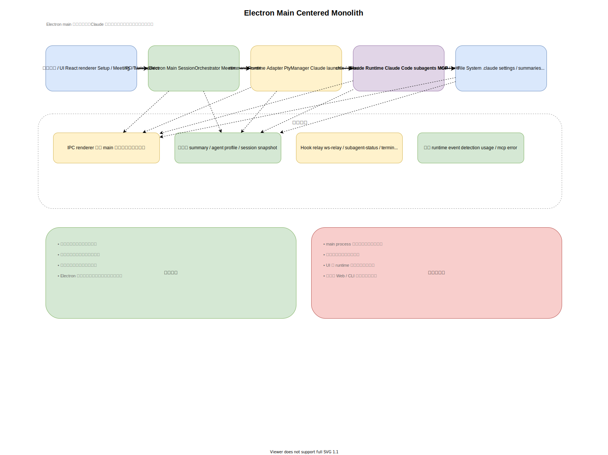
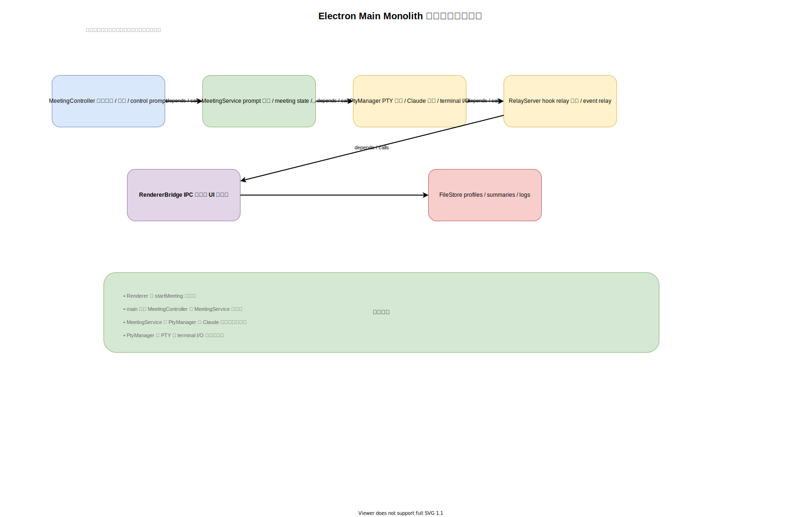
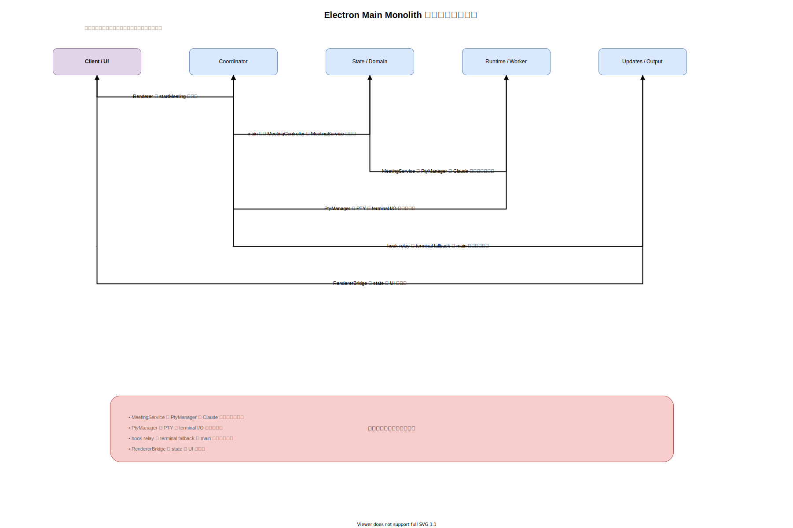

# 案1: Electron Main 中心モノリス

作成日: 2026-03-06

## 概要

現在の配置を大きく変えず、Electron main をアプリケーションの中心として再構築する案です。renderer は薄い UI に留め、主なロジックは main に集約します。

## この案の一言要約

Electron `main process` を司令塔にして、会議制御、Claude 起動、relay 受信、永続化をすべて同一プロセスでまとめる案です。

## 想定ユースケース

- まず早く安定版を出したい
- Electron デスクトップ専用と割り切れる
- 実行系を別プロセスへ切り出すコストを避けたい

## 構成

- `renderer`
  - セットアップ画面
  - 会議画面
  - ターミナル画面
  - デバッグ画面
- `electron main`
  - セッション制御
  - PTY 管理
  - Hook 中継の受信
  - ランタイムイベント検知
  - 永続化
  - IPC 契約

## 推奨モジュール分割

- `SessionOrchestrator`
  - 会議の開始、一時停止、再開、終了を担当
- `ClaudeRuntimeAdapter`
  - PTY 起動、Claude 起動、stdin/stdout を担当
- `RelayNormalizer`
  - Hook と terminal fallback を正規化イベントへ変換
- `MeetingStore`
  - summary、profile、snapshot の保存
- `IpcPresenter`
  - renderer への入出力窓口

## 代表的な処理

### 会議開始

1. renderer が IPC で `startMeeting` を送る
2. main が PTY を起動する
3. Claude を起動する
4. ready signal を見て初回プロンプトを送る
5. renderer に state を返す

### メッセージ受信

1. Hook relay または terminal fallback が main に届く
2. `RelayNormalizer` が内部イベントへ変換する
3. renderer に IPC で流す
4. renderer がチャットを更新する

### 健全性監視

- main が PTY tail と relay payload を見て warning / error を判定する
- renderer はその結果を表示するだけに留まる

## この案で作るなら想定されるクラス構成

この案では、`MeetingController`、`MeetingService`、`PtyManager`、`RelayServer` のようなクラスが同一プロセスの中で密に連携する構成になりやすいです。

## この案での主要処理フロー

会議開始から Claude 起動、relay 受信、UI 更新までを Electron main の中で吸収する流れになります。

## データの持ち方

- meeting 一覧
- セッション状態
- pending init prompt
- debug tail
- summary / profile

これらを main 側のメモリとファイル保存で管理することになります。

## メリット

- 最も早く作り直せる
- 今のコードと発想を引き継ぎやすい
- 配布や起動が単純
- 初期デバッグ時の追跡箇所が少ない
- Electron 専用アプリなら一定の合理性がある

## デメリット

- main process が再び肥大化しやすい
- Electron 依存が強く、単体テストしづらい
- UI と実行系の関心が近すぎる
- 将来 Web UI を追加しづらい
- Claude 連携の差し替えコストが高い
- セッション継続の主体が Electron になりやすい

## この案が弱い理由

今回の将来要件は「Mac 上のセッションを維持したまま、iPhone / Web から後から接続する」ことです。
この案だと session host が Electron に寄りやすく、将来 Web クライアントを足す時に境界を引き直す可能性が高いです。

## 向いているケース

- 短期間で安定版を作りたい
- スコープが小さい
- Electron デスクトップ専用で良い

## 主なリスク

見た目は整理されても、時間が経つと再び巨大な main process に戻りやすい点が最大のリスクです。

## この案を採らない理由

この案は短期的には魅力がありますが、今回のゴールである「session host を Mac 側に置き、将来 Web / iPhone に広げる」方向とは相性が良くありません。
したがって、比較対象として残しつつ、最終推奨からは外します。
