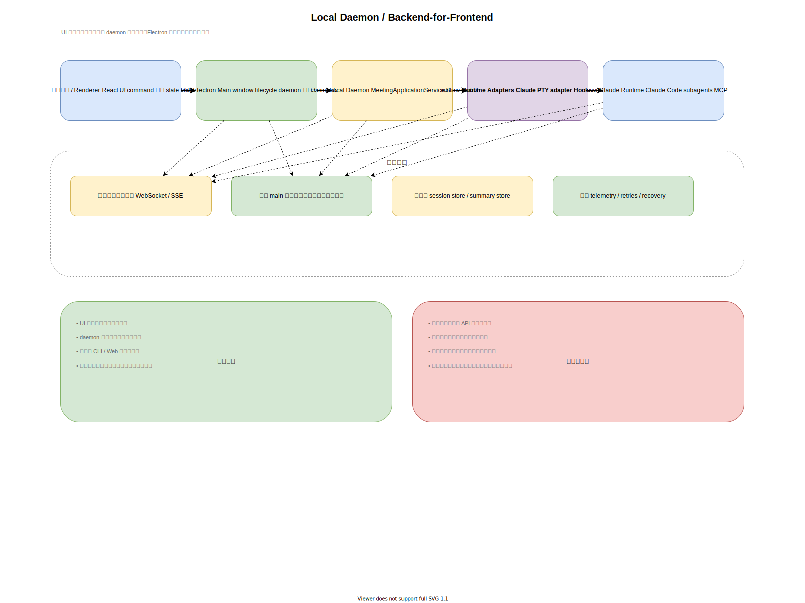
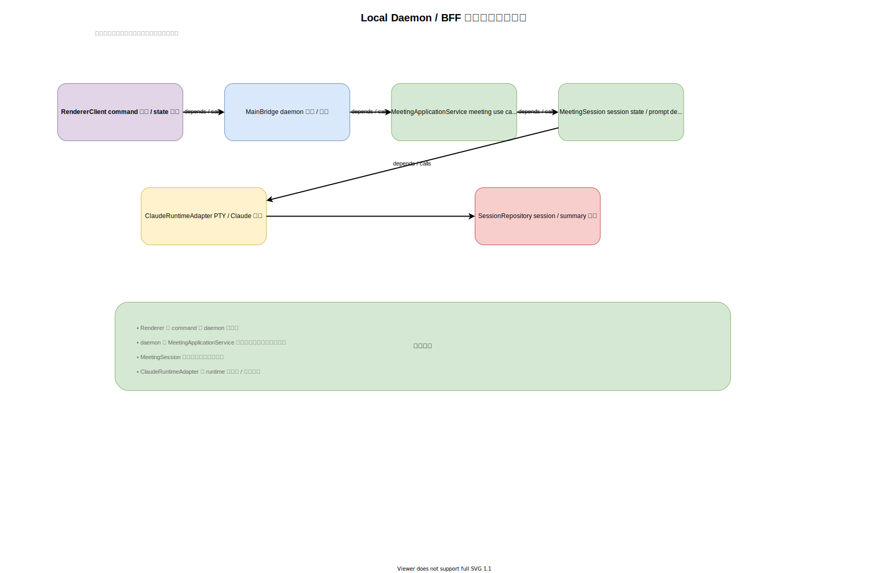
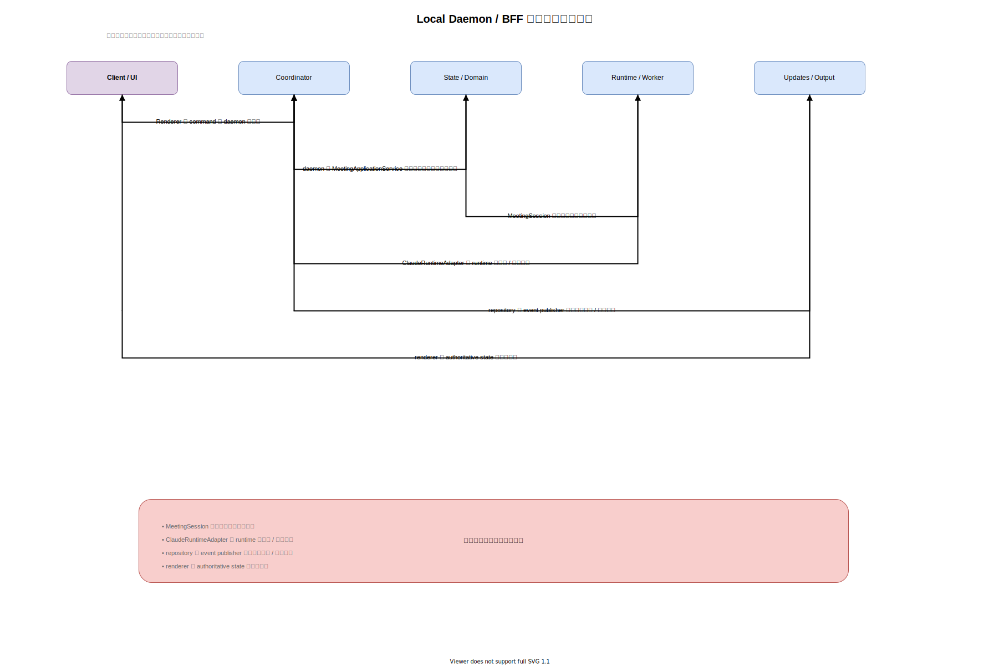

# 案2: Local Daemon / Backend-for-Frontend

作成日: 2026-03-06

## 概要

実行系の本体をローカル常駐サービスへ切り出し、Electron はほぼ UI のみを担う案です。会議制御、Claude 連携、永続化、イベント配信は daemon 側が持ちます。

## この案の一言要約

Mac 上の `meeting-room-daemon` を会議セッションの本体にして、Electron と将来の Web UI はそのクライアントにする案です。

## なぜ有力か

今回の将来像は次です。

- Mac 上で会議セッションが継続して生きる
- iPhone からトンネル経由でそのセッションへ後から接続できる
- 必要に応じて Web UI を追加できる
- CLI は前提にしない

この要件に最も素直に合うのが、この daemon / BFF 方式です。

## 構成

- `renderer`
  - React UI のみ
- `electron main`
  - ウィンドウ管理のみ
- `meeting-room-daemon`
  - 会議アプリケーションサービス
  - ランタイム制御
  - 永続化
  - テレメトリ
  - イベント配信サーバ

通信は次のように分けます。

- command API
- WebSocket または SSE によるリアルタイム更新

## プロセス境界

### Electron Renderer

- 画面描画
- command 送信
- event 購読
- ローカル一時表示状態のみ保持

### Electron Main

- BrowserWindow 管理
- daemon 起動または接続
- OS との最小限の橋渡し

### meeting-room-daemon

- session host
- runtime orchestration
- health monitoring
- persistence
- event stream

## command / event モデル

### Command

- `startMeeting`
- `sendHumanMessage`
- `pauseMeeting`
- `resumeMeeting`
- `endMeeting`
- `retryMcp`
- `getSessionDebug`

### Event

- `meeting.started`
- `message.received`
- `agent.status_changed`
- `runtime.warning`
- `runtime.error`
- `meeting.ended`
- `session.snapshot.updated`

UI は polling ではなく、event stream を購読して状態を更新します。

## 推奨モジュール

- `MeetingApplicationService`
- `MeetingSessionManager`
- `ClaudeRuntimeBridge`
- `RuntimeEventNormalizer`
- `SessionRepository`
- `EventPublisher`
- `HealthMonitor`

## API の考え方

### Command API

用途は「UI から daemon への意図伝達」です。

- Electron から呼ぶ
- 将来の Web UI からも同じ契約で呼ぶ
- session host の source of truth は daemon に寄せる

### Event Stream

用途は「daemon から UI への変化通知」です。

- 新しいメッセージ
- agent 状態変化
- runtime warning / error
- session 終了

これにより、UI は再接続可能になります。

## 永続化

daemon が次を保持します。

- session metadata
- summary
- agent profile / config
- health snapshot
- 必要なら重要イベントログ

永続化先は最初は file-based でもよいですが、将来を考えると SQLite に寄せやすい構成にしておくのが自然です。

## 再接続モデル

この案では UI は disposable です。

- Electron を再起動しても daemon に再接続できる
- 将来 iPhone の Web UI でも同じ session を購読できる
- UI は projection を読み直して現在状態へ復帰できる

## トンネル / リモートアクセス前提での利点

将来 iPhone から使う場合は、Mac 側 daemon をトンネル越しに公開する形になります。

- Mac が session host
- iPhone は remote UI
- command は API で送る
- event は WebSocket / SSE で受ける

この構成は「Electron が本体」の設計よりはるかに自然です。

## この案で作るなら想定されるクラス構成

この案では、renderer と daemon の境界を越えて、`MeetingApplicationService`、`MeetingSession`、`ClaudeRuntimeBridge`、`SessionRepository` の責務分離が中心になります。

## この案での主要処理フロー

ユーザー操作は daemon の command に変換され、state 更新と event 配信を経由して UI に戻る流れになります。

## メリット

- UI と実行系を明確に分離できる
- Electron なしで daemon をテストできる
- UI 再起動時の影響を減らせる
- 将来 Web クライアントを追加しやすい
- セッション復元や状態永続化の置き場所が明確
- 監視、再試行、ヘルスチェックを入れやすい

## デメリット

- プロセス境界の設計が必要
- ローカル起動と配布が少し複雑になる
- API 設計の初期コストがある
- 単一プロセスより構成要素が増える

## 向いているケース

- 今後も育てる前提のプロダクト
- 信頼性が重要
- UI の都合から実行系を切り離したい
- 将来別クライアントを追加する可能性がある

## 主なリスク

UI と daemon の境界を雑に作ると、状態の二重管理や過度に細かい通信が発生しやすい点がリスクです。

## この案の位置づけ

この案は、今回の再設計の土台です。
ただし、内部状態管理のすべてを普通の CRUD 的 state に寄せるのではなく、重要フローには event log を部分導入する前提で考えるのがより現実的です。
