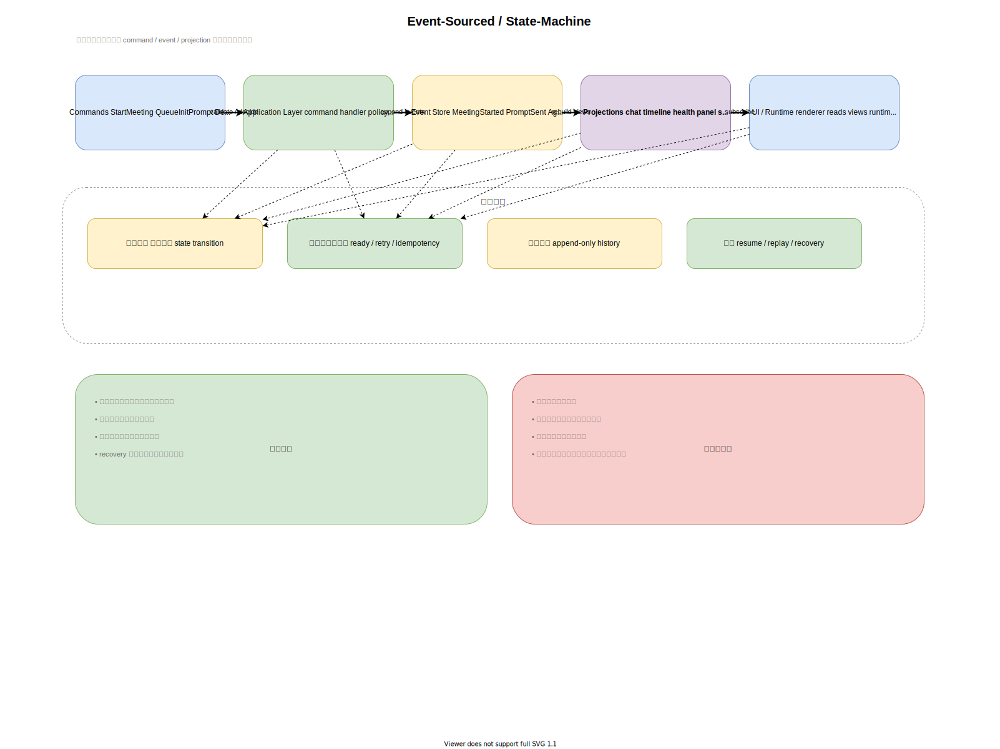
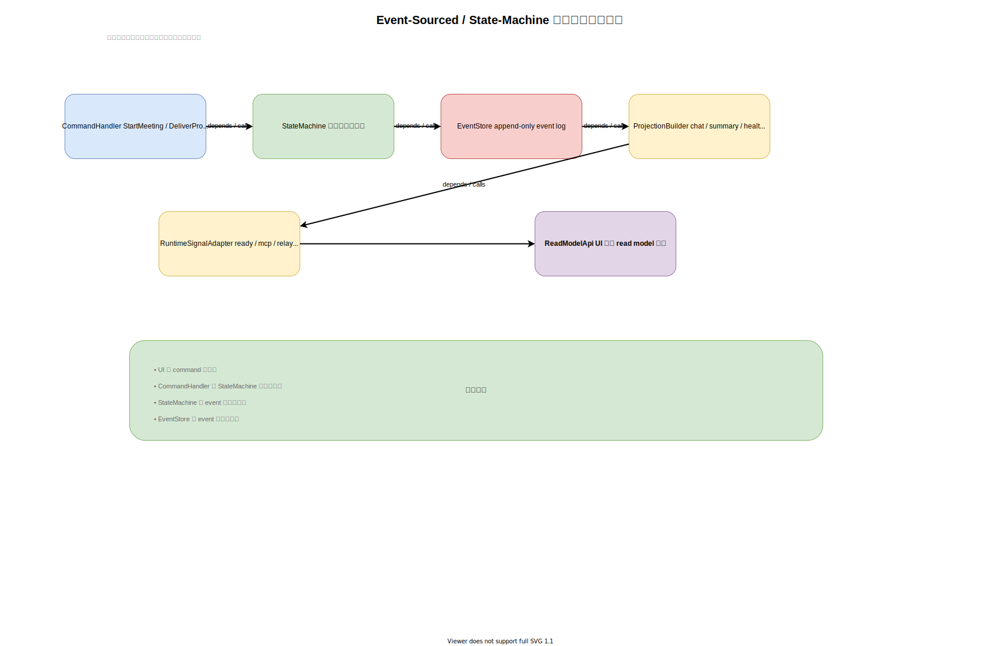
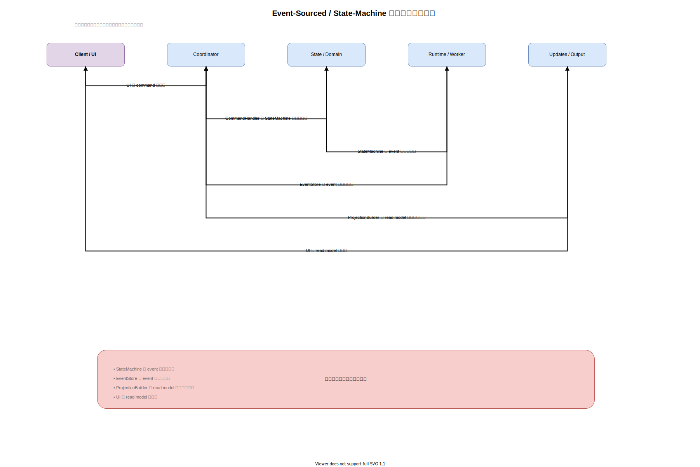

# 案3: Event-Sourced / State Machine

作成日: 2026-03-06



## 概要

会議システムを、明示的な command、state transition、append-only event で管理する案です。タイミング依存やレースコンディションに強い設計になります。

## この案の一言要約

「今の状態」ではなく「何が起きたかの履歴」を中心に据え、現在状態は event の積み上げから作る案です。

## 中心となる考え方

フラグやタイマーやコールバックに分散させるのではなく、次のようなモデルで扱います。

- command
  - `StartMeeting`
  - `QueueInitPrompt`
  - `DeliverPrompt`
  - `RetryMcp`
- event
  - `MeetingStarted`
  - `ClaudeReadyDetected`
  - `InitPromptQueued`
  - `InitPromptSent`
  - `AgentMessageReceived`
  - `McpFailureDetected`
  - `MeetingEnded`
- projection
  - 会議サマリー
  - 現在のチャット履歴
  - セッション健全性パネル

## 何が強いのか

このプロダクトでは、次のような非同期入力が競合します。

- PTY 出力
- Hook relay
- ready signal
- 人間入力
- retry
- session end

これらを event として順序付きで残すと、「何がいつ起きて今どうなっているか」を追いやすくなります。

## 代表的な event log の例

```text
MeetingStarted
InitPromptQueued
ClaudeReadyDetected
InitPromptSent
AgentMessageReceived
McpFailureDetected
MeetingEnded
```

この列から、現在の meeting state や health 状態を再構築します。

## projection の役割

event log をそのまま UI に見せるのではなく、次の read model を組み立てます。

- `MeetingViewProjection`
  - 現在状態
  - メッセージ一覧
  - active agents
- `HealthProjection`
  - MCP failure
  - runtime warning
  - reconnect 状態
- `SummaryProjection`
  - 保存用要約

## この案で作るなら想定されるクラス構成



この案では、`CommandHandler`、`StateMachine`、`EventStore`、`ProjectionBuilder` が中心になり、状態変化をイベントとして明示的に積み上げます。

## この案での主要処理フロー



UI は command を投げ、内部では event が保存され、その結果として read model が再構築される流れになります。

## この案をそのまま全面採用する場合のコスト

- command handler が必要
- state machine が必要
- event store が必要
- projection builder が必要
- event replay を前提にした設計が必要

これはとても強いですが、初期コストも高いです。

## このプロダクトで現実的な使い方

全面採用ではなく、重要フローだけ取り入れるのが現実的です。

### event log に入れるべきもの

- 会議開始 / 終了
- init prompt queue / delivery
- Claude ready 検知
- runtime failure
- human message submit
- agent message receive

### event log に入れなくてよいもの

- 生の terminal chunk 全量
- UI の一時状態
- 低レベルのデバッグノイズ
- 単なる描画用キャッシュ

## メリット

- タイミング系バグに最も強い
- セッション再現とデバッグがしやすい
- 何がいつ起きたかを監査しやすい
- resume や recovery 機能の基盤に向く
- 隠れた状態が減る

## デメリット

- 実装難易度が高い
- 単純な機能でも記述量が増える
- チーム全体で設計思想を揃える必要がある
- 現段階ではやや重い可能性がある

## 向いているケース

- セッション整合性を最優先したい
- 再現性や観測性が重要
- 複数の非同期入力が競合しやすい

## 主なリスク

設計としては優秀でも、現状のスコープに対して重すぎると開発速度を大きく落とす可能性があります。

## この案の位置づけ

この案は単独採用よりも、`Local Daemon / BFF` の内部で重要イベントだけに適用するのが最も実務的です。
