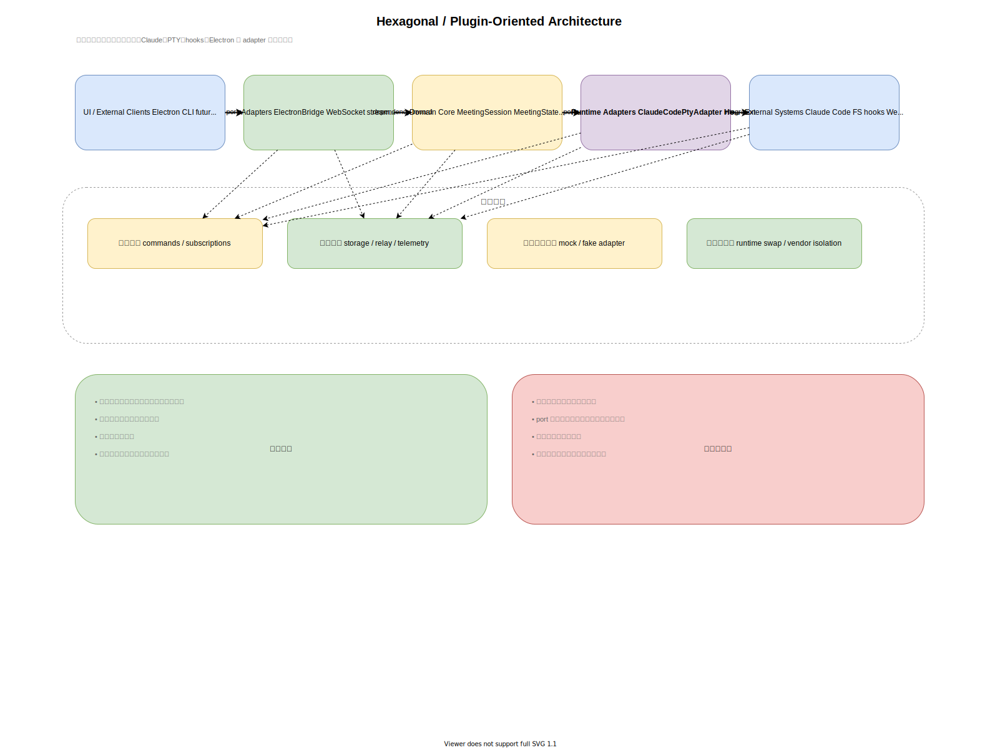
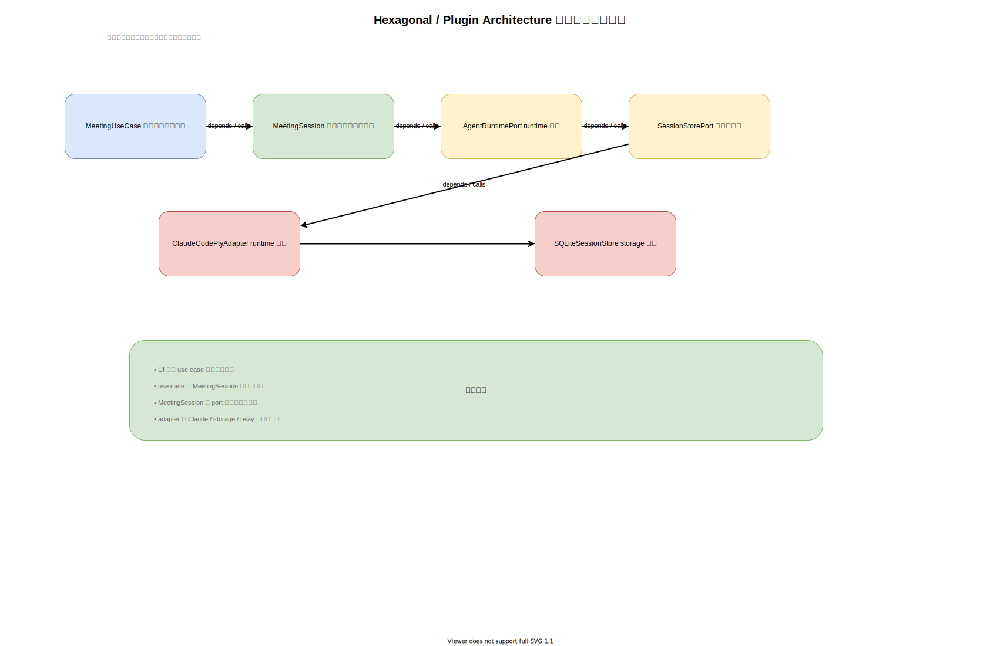
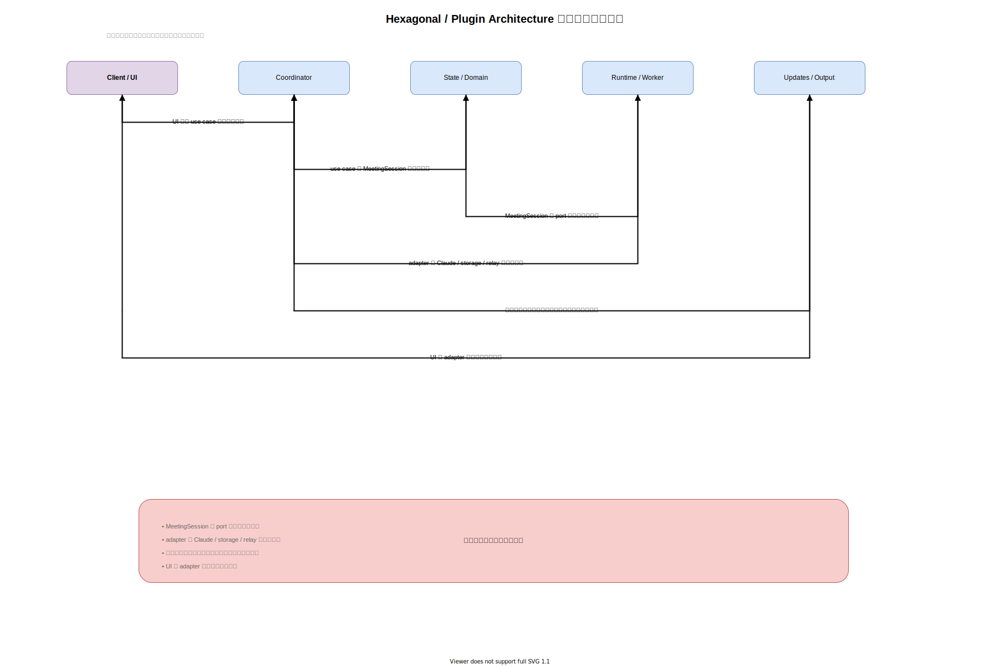

# 案4: Hexagonal / Plugin-Oriented Architecture

作成日: 2026-03-06

## 概要

会議ドメインを中心に置き、Claude Code、PTY、hooks、WebSocket、ファイル、Electron などをすべて外側の adapter として扱う案です。

要点は、外部ツールをコアの前提にしないことです。

## コアとなる Port

- `AgentRuntimePort`
- `PromptDeliveryPort`
- `RelayIngressPort`
- `MeetingRepositoryPort`
- `SummaryStorePort`
- `TelemetryPort`
- `UiSubscriptionPort`

## 代表的な Adapter

- `ClaudeCodePtyAdapter`
- `HookRelayAdapter`
- `TerminalFallbackAdapter`
- `FileSystemMeetingRepository`
- `ElectronBridgeAdapter`
- `WebSocketUiStreamAdapter`

## この案で作るなら想定されるクラス構成

この案では、`MeetingUseCase` と `MeetingSession` を中心に据え、`Port` と `Adapter` で外部依存を隔離する構成になります。

## この案での主要処理フロー

主要フローは use case から domain へ入り、外部システムとは port 越しにだけ接続する流れになります。

## メリット

- ランタイム差し替えに強い
- ドメインロジックをモックでテストしやすい
- 特定ツールへのロックインを減らせる
- 外部障害の境界が明確になる
- 依存方向を守りやすい

## デメリット

- 最初の設計コストが高い
- 抽象化が多く見えやすい
- Port を増やしすぎると複雑化する
- 初期の試作速度はやや落ちる

## 向いているケース

- ランタイム統合が今後も変わりうる
- 長期でコアロジックを守りたい
- 外部ツールを交換可能にしたい

## 主なリスク

境界が曖昧なまま抽象化だけ増やすと、柔軟性よりも儀式的な複雑さが勝ってしまいます。
