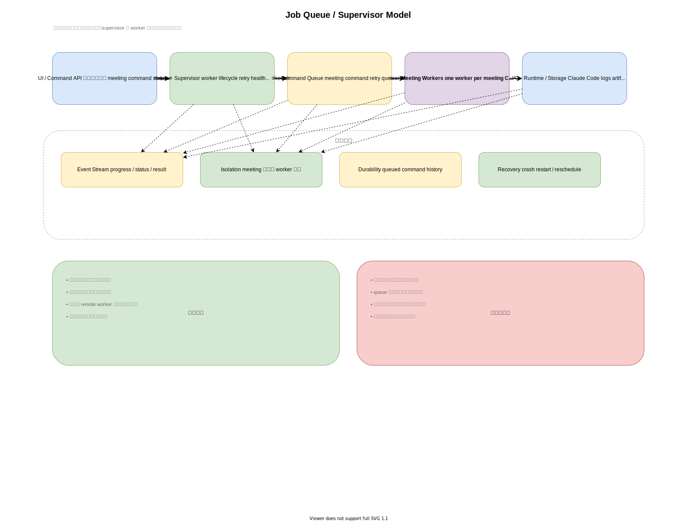
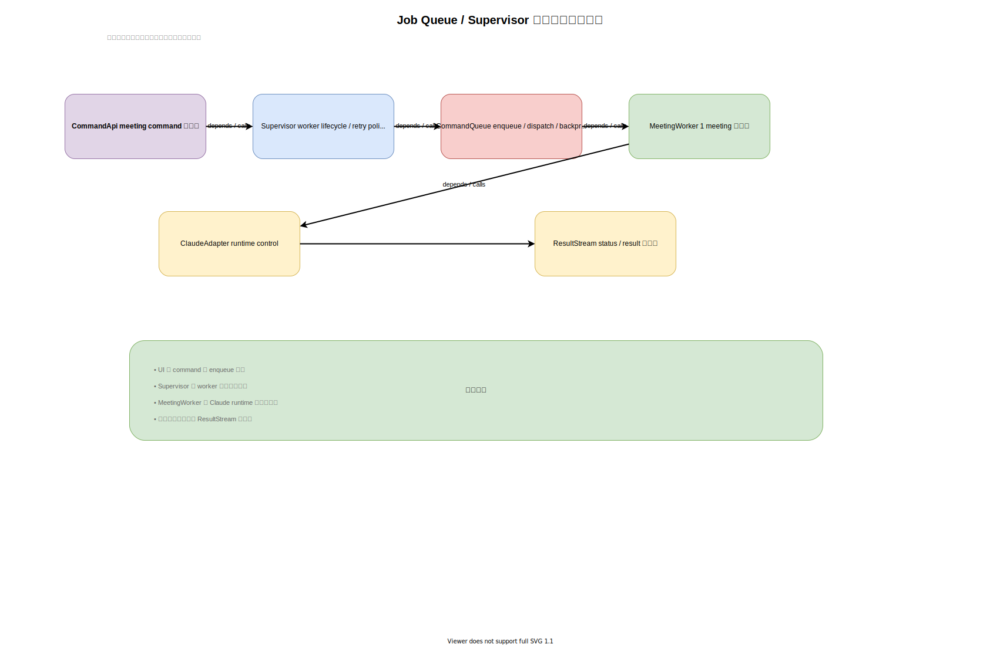
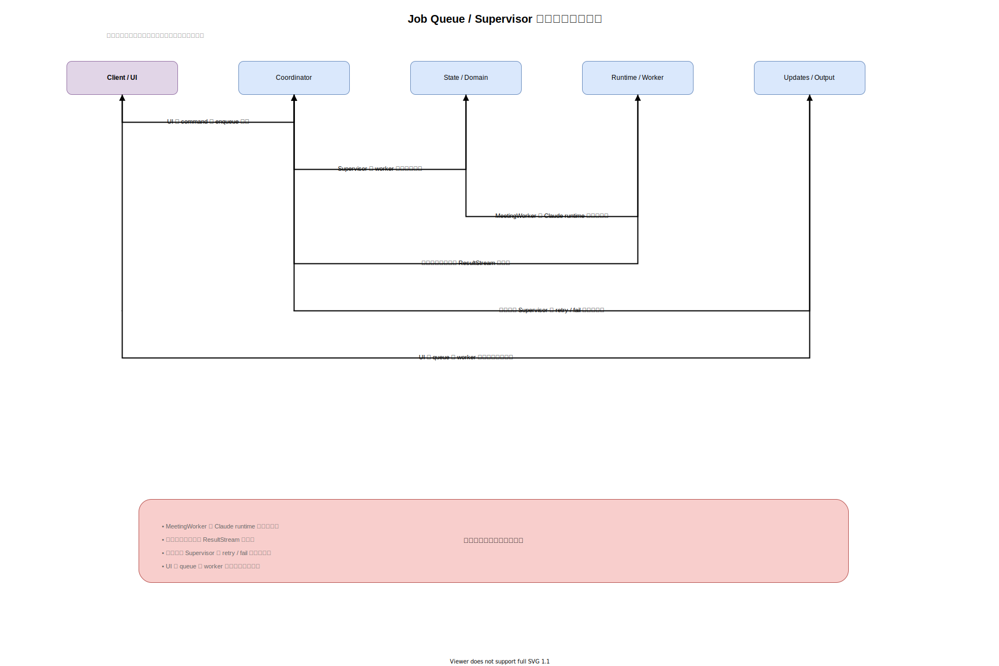

# 案5: Job Queue / Supervisor Model

作成日: 2026-03-06

## 概要

各会議を独立ジョブとして扱い、supervisor が worker を起動、監視、再試行する案です。UI は command を投げ、event stream を購読します。

## 構成

- `Supervisor`
  - worker のライフサイクル管理
  - 異常時の再起動や失敗確定
- `MeetingWorker`
  - 1つの meeting session を実行
  - Claude runtime と対話
- `CommandQueue`
  - ユーザー入力や制御命令を受け取る
- `EventStream`
  - UI へ状態更新を配信

## この案で作るなら想定されるクラス構成

この案では、`Supervisor`、`CommandQueue`、`MeetingWorker`、`ClaudeAdapter`、`ResultStream` のようなジョブ実行系クラスが中心になります。

## この案での主要処理フロー

UI からの command は queue に積まれ、worker 実行と status 配信を経由して反映される流れになります。

## メリット

- 会議ごとの隔離性が高い
- 並列 meeting に強い
- 再試行や crash recovery を入れやすい
- 将来 remote worker 化しやすい

## デメリット

- 今の規模に対して最も複雑
- インフラ的な仕組みが増える
- ローカルデバッグがやや難しくなる
- queue 自体の失敗も考慮が必要

## 向いているケース

- 多数の会議を並列に回す
- 長時間バックグラウンド実行が中心
- 将来的に分散実行へ進む

## 主なリスク

現時点のプロダクト規模では、必要以上に重い設計になる可能性が高いです。
