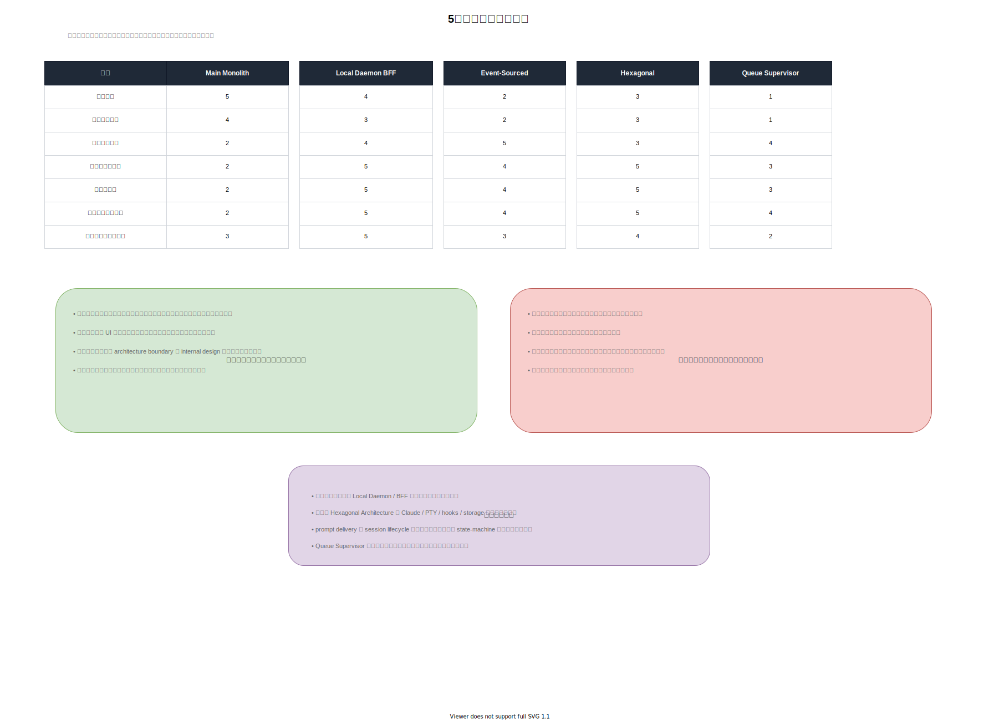

# 5案の比較

作成日: 2026-03-06

## クイック比較

| 観点               | 1. Main Monolith | 2. Local Daemon BFF | 3. Event-Sourced | 4. Hexagonal | 5. Queue Supervisor |
| ------------------ | ---------------: | ------------------: | ---------------: | -----------: | ------------------: |
| 開発速度           |                5 |                   4 |                2 |            3 |                   1 |
| 運用の単純さ       |                4 |                   3 |                2 |            3 |                   1 |
| 非同期信頼性       |                2 |                   4 |                5 |            3 |                   4 |
| テストしやすさ     |                2 |                   5 |                4 |            5 |                   3 |
| 長期保守性         |                2 |                   5 |                4 |            5 |                   3 |
| ランタイム柔軟性   |                2 |                   5 |                4 |            5 |                   4 |
| 現プロダクト適合性 |                3 |                   5 |                3 |            4 |                   2 |

スコアの意味:

- `5` = 強い
- `1` = 弱い

## 比較ポイント

### 案1 と 案2

案1は早く作れますが、長く使う前提なら案2の方が境界設計として明らかに優れています。

### 案2 と 案4

この2つは競合ではなく組み合わせる余地があります。ただし、現時点では案4をフルに採用するより、Claude / PTY / Hook の詳細を一箇所へ閉じ込める薄い adapter 境界として取り入れる方が現実的です。

### 案3 と 案2

案3は時系列の正しさに強く、案2は実装現実性に優れます。最初は案2で組み、会議開始、初回プロンプト配送、runtime failure、meeting end など重要フローだけ案3の event log を導入するのが現実的です。

### 案5 とその他

案5は並列実行や worker 分散が主目的になる段階で効いてきます。現状だと先行投資が大きすぎます。

## 実務的な結論

最も現実的で将来の後悔が少ない方向は次です。

- 外側は案2
- 状態管理は案3の軽量版を部分導入
- 実行ランタイム境界は案4を薄く取り入れる

特に、Mac 上のセッションを保持したまま将来 iPhone / Web UI から接続したい、という要件にはこの組み合わせが最も合います。
