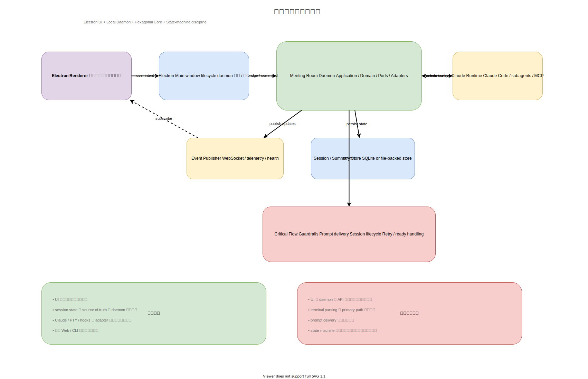

# 推奨アーキテクチャ

作成日: 2026-03-06



## 最終推奨

最も良い構成は次の組み合わせです。

- システム境界として `Local Daemon / Backend-for-Frontend`
- 状態管理として `重要イベント中心の event log`
- 実行ランタイム境界として `薄い adapter / bridge`

この組み合わせが、正しさ、保守性、将来拡張性のバランスを最も良く保てます。

## なぜこれが最適か

現在のアプリの難所は UI ではなく、実行系です。

- PTY 経由の Claude 起動
- hook relay の正規化
- 初回プロンプト送信タイミング
- ランタイム健全性の検知
- durable な session state

これらは Electron UI の中ではなく、独立した実行コアに置くべきです。

加えて、将来的に欲しい形は次です。

- Mac 上で会議セッションが継続して生きる
- iPhone からトンネル経由でそのセッションへ後から接続できる
- 必要に応じて Web UI を追加できる
- CLI は前提にしない

この将来像だと、Electron を本体にするより、Mac 上の daemon を本体にする方が筋が良いです。

## 推奨トップレベル構成

```text
src/
  apps/
    desktop/
      src/main/
      src/renderer/
    web/
      src/
  daemon/
    src/app/
    src/runtime/
    src/events/
    src/http/
  packages/
    shared-contracts/
    meeting-room-support/
    meeting-room-hooks/
```

補足:

- `src/apps/desktop/dist/`, `src/apps/web/client/`, `src/apps/web/share-client/`, `src/daemon/dist/` は配信用または build 生成物で、repo では commit 対象外にする

## 推奨責務分割

### Electron Renderer

- setup、meeting、terminal、debug 画面を描画
- ユーザー意図を command として送る
- 権威ある session state を購読する
- 業務状態の真実を持ちすぎない

### Electron Main

- window 管理
- app lifecycle 管理
- daemon の起動または接続
- ドメインロジックは持たない

### Meeting Room Daemon (`src/daemon`)

- 会議ライフサイクル全体を管理
- Claude session を管理
- runtime と hook のイベントを正規化
- session state と summary を永続化
- リアルタイム更新を配信

## 推奨 daemon モジュール

### Application Layer

- `StartMeetingUseCase`
- `SendHumanMessageUseCase`
- `ApplyMeetingControlUseCase`
- `RetryMcpUseCase`
- `GetSessionDebugUseCase`

### Domain Layer

- `MeetingSession`
- `MeetingState`
- `RuntimeHealth`
- `PromptDeliveryState`

### Runtime Boundary

- `ClaudeRuntimeBridge`
- `ClaudeSessionHandle`
- `RuntimeEventNormalizer`

ここでは full な plugin abstraction を最初から作りすぎないことが重要です。
目的は「将来の全ランタイム共通抽象」を先回りで決めることではなく、Claude / PTY / Hook の詳細を meeting core に漏らさないことです。

### Infrastructure

- `ClaudeCodePtyRuntime`
- `HooksRelayReceiver`
- `FileSystemSessionStore`
- `SummaryFileStore`
- `WebSocketEventPublisher`
- `HttpCommandApi`

### Event Log / Projection

- `SessionEventLog`
- `SessionProjectionBuilder`
- `MeetingViewProjection`
- `HealthProjection`

event sourcing を全面採用するのではなく、重要イベントだけ append-only に記録する。

例:

- `MeetingStarted`
- `InitPromptQueued`
- `ClaudeReadyDetected`
- `InitPromptSent`
- `HumanMessageSubmitted`
- `AgentMessageReceived`
- `McpFailureDetected`
- `MeetingEnded`

## 重要な設計ルール

- meeting state の source of truth は daemon に置く
- prompt delivery は冪等にする
- terminal parsing は primary path ではなく fallback にする
- hook payload と PTY 出力は同じイベントモデルへ正規化する
- session transition は明示的かつ観測可能にする
- Claude 固有の ready signal、PTY 入出力、Hook payload 形式は runtime bridge 内に閉じ込める
- UI には command と event だけを出し、Claude の生仕様を見せない

## 推奨 command / event モデル

### Command

- `startMeeting`
- `sendHumanMessage`
- `pauseMeeting`
- `resumeMeeting`
- `endMeeting`
- `retryMcp`

### Event

- `meeting.started`
- `message.received`
- `agent.status_changed`
- `runtime.warning`
- `runtime.error`
- `meeting.ended`

command で操作し、event で変化を流す。
その裏で重要イベントだけ event log に残し、現在状態は projection として組み立てる。

## 将来の iPhone / Web 対応

将来 iPhone から使う時は、Mac 上の daemon が session host になります。

- Electron と Web は同じ daemon に接続するクライアントになる
- セッションは Mac 側で継続する
- iPhone はトンネル経由で command と event stream に参加する
- UI 再接続時は projection を読み直せば復元できる

CLI を無理に支える前提ではなく、Electron + Web を支える BFF として設計するのが自然です。

## 推奨移行手順

1. Electron main から orchestration を daemon へ切り出す
2. persistence と session state を renderer から外す
3. Claude / PTY / Hook の詳細を `ClaudeRuntimeBridge` に集約する
4. relay 処理を正規化イベント受信へ置き換える
5. meeting session の状態モデルを導入する
6. 重要フローにだけ replay 可能な event log を加える
7. 将来の Web UI 用に command API と event stream 契約を固定する

## 最終判断

もし再構築で1つの方向に絞るなら、選ぶべきなのはこれです。

`Electron UI + local daemon + important-event log + thin Claude runtime boundary`

これが、このアプリにとって最も筋が良く、将来の後悔が少ない構成です。

full な runtime-agnostic plugin system を先に作る必要はありません。
まずは Claude 依存を core の外へ追い出し、将来 2つ目の runtime が本当に必要になった時に、その時点で境界を見直すのが最も現実的です。

この推奨案に対する実装計画:

- `../08_implementation-plan/08_implementation-plan.md`
- `../08_implementation-plan/08_phase-1-daemon-foundation.md`
- `../08_implementation-plan/08_phase-2-runtime-bridge.md`
- `../08_implementation-plan/08_phase-3-session-state-events.md`
- `../08_implementation-plan/08_phase-4-electron-integration.md`
- `../08_implementation-plan/08_phase-5-web-readiness.md`

各案の詳細化資料:

- `../01_electron-main-monolith/01_electron-main-monolith.md`
- `../02_local-daemon-bff/02_local-daemon-bff.md`
- `../03_event-sourced-state-machine/03_event-sourced-state-machine.md`
- `../04_hexagonal-plugin-architecture/04_hexagonal-plugin-architecture.md`
- `../05_job-queue-supervisor/05_job-queue-supervisor.md`
